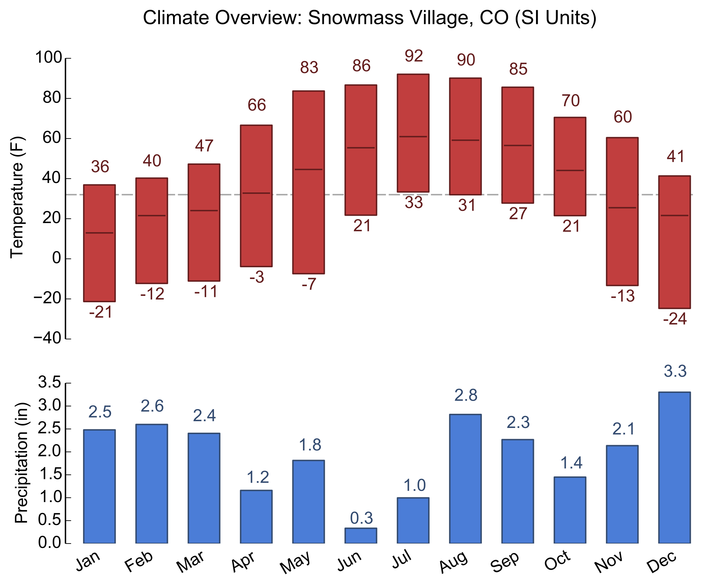

# climate-chart

A hacked-together climate chart generator. Dependencies:

* numpy
* matplotlib

Usage: `python plot.py <climate-file>`

Where climate-file contains values in this format:

```
<month-num>  <high-temp>  <low-temp>  <total-precip>  <avg-temp>
```

(No clue why this is the ordering; must've been too many sleep-deprived nights before writing this script...)

This will produce an output something like the following:


